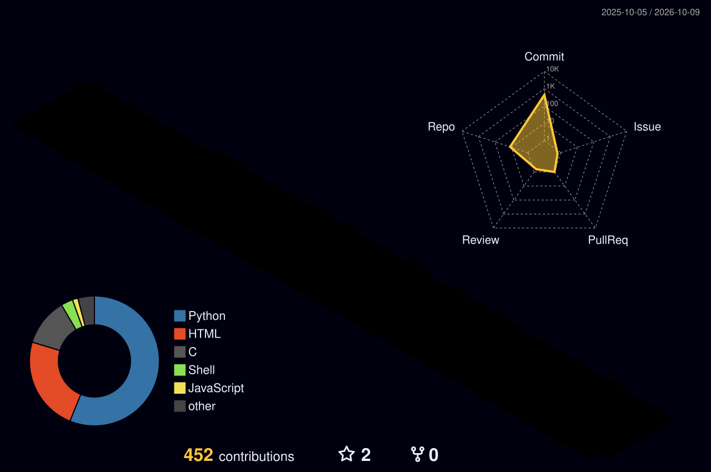

  <!-- Floating Cyberpunk Hero Banner -->
  

  <!-- Dynamic Typing Telemetry Header -->
  

  <!-- Quick Action Navigation Pills -->
  

    
    
    
    
  

---

### 🌐 3D Isometric Git Visualization & City Telemetry

  

  
🕹️ <b>Contribution Grid Arcade Snake</b>

   
  

    <picture>
      <source media="(prefers-color-scheme: dark)" srcset="https://raw.githubusercontent.com/subham-cse/subham-cse/output/github-snake-dark.svg">
      <source media="(prefers-color-scheme: light)" srcset="https://raw.githubusercontent.com/subham-cse/subham-cse/output/github-snake.svg">
      
    </picture>
  

---

### 🏆 3D Profile Achievements & Honors

  

---

### 📊 3D Telemetry & GitHub Performance Analytics

  <table width="100%" border="0" cellspacing="0" cellpadding="0">
    <tr align="center">
      <td width="50%" align="center" style="padding: 6px;">
        
      </td>
      <td width="50%" align="center" style="padding: 6px;">
        
      </td>
    </tr>
  </table>

---

### ⚡ Domain Tech Matrix & Tooling

<table width="100%">
  <thead>
    <tr>
      <th width="30%" align="left"><b>Domain Cluster</b></th>
      <th width="70%" align="left"><b>3D Glow Tech Stack</b></th>
    </tr>
  </thead>
  <tbody>
    <tr>
      <td><b>⚙️ Low-Level &amp; Systems Core</b></td>
      <td>
        
      </td>
    </tr>
    <tr>
      <td><b>🌐 Web &amp; Full-Stack</b></td>
      <td>
        
      </td>
    </tr>
    <tr>
      <td><b>🗄️ Databases &amp; Cloud Infrastructure</b></td>
      <td>
        
      </td>
    </tr>
    <tr>
      <td><b>🛠️ Developer Suite</b></td>
      <td>
        
      </td>
    </tr>
  </tbody>
</table>

---

### 🚀 Featured Systems & Engineering Roadmap

<table width="100%">
  <thead>
    <tr>
      <th width="30%" align="left"><b>System / Architecture</b></th>
      <th width="48%" align="left"><b>Engineering Highlights &amp; Stack</b></th>
      <th width="22%" align="center"><b>Repository</b></th>
    </tr>
  </thead>
  <tbody>
    <tr>
      <td>
        <b>⚡ 50-Days-of-C</b> 
        Systems Programming &amp; Memory Internals
      </td>
      <td>
        • Pointer arithmetic, custom allocators &amp; <code>malloc</code> internals 
        • POSIX file streams, file descriptors &amp; process pipelines 
        • Memory alignment &amp; data structure optimization
      </td>
      <td align="center">
        
      </td>
    </tr>
    <tr>
      <td>
        <b>💻 10-Days-of-Bash</b> 
        Enterprise Automation &amp; Stream Processing
      </td>
      <td>
        • Advanced <code>awk</code>, <code>sed</code>, and regex stream pipelines 
        • Sysadmin automation, log audit daemons &amp; cron telemetry 
        • POSIX-compliant modular shell architecture
      </td>
      <td align="center">
        
      </td>
    </tr>
    <tr>
      <td>
        <b>🔥 365-Days-of-Building</b> 
        Polyglot Systems &amp; Language Internals
      </td>
      <td>
        • In-depth daily findings across 16 programming languages 
        • Concurrency models, memory layout traps &amp; compiler behavior 
        • High-throughput algorithmic problem-solving patterns
      </td>
      <td align="center">
        
      </td>
    </tr>
    <tr>
      <td>
        <b>🤖 AI-Resume Analyzer</b> 
        Automated Recruitment Scoring Engine
      </td>
      <td>
        • <b>Streamlit</b> interactive dashboard with real-time feedback 
        • <b>Python NLP / PyPDF2</b> heuristic section &amp; ATS keyword parsing 
        • <b>MySQL</b> persistent candidate telemetry and scoring analytics
      </td>
      <td align="center">
        
      </td>
    </tr>
    <tr>
      <td>
        <b>🌍 Air Watch Dashboard</b> 
        Real-Time Atmospheric Telemetry
      </td>
      <td>
        • <b>WAQI REST API</b> multi-station geospatial ingestion engine 
        • <b>Plotly / Dash</b> dynamic telemetry visualization &amp; mapping 
        • Continuous caching, alerting thresholds &amp; time-series trends
      </td>
      <td align="center">
        
      </td>
    </tr>
  </tbody>
</table>

---

  Engineered with ⚡ precision by <a href="https://subham-mallick-portfolio.netlify.app/"><b>Subham Mallick</b></a> • Continuously synchronized via GitHub Actions
    
  

